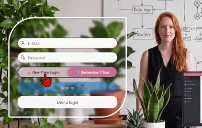

# Oracle APEX Toggle Switch


A **segmented toggle switch** item plug-in for Oracle APEX.

The native APEX switch handles exactly two fixed values. This one is driven by a List of Values and renders **one segment per entry** — so the same plug-in covers a simple yes/no as comfortably as a five-way choice. Colors, border color and border width are configurable per item, and sizing follows the standard APEX width setting.


---

## ✨ Features

- 🔀 **LOV-driven** — static values, SQL query or a shared List of Values
- 🔢 **Any number of options** — two, three, five; one segment per entry
- 🎨 **Configurable colors** — track, knob and border, each with a color picker
- 📏 **Configurable border** — from hairline to heavy frame, or none at all
- 📐 **Standard APEX sizing** — Default, Large, X-Large and Stretch all work as expected
- ⌨️ **Keyboard accessible** — Tab to focus, Enter or Space to select
- 💾 **Behaves like a normal item** — session state, submit, Dynamic Actions, all standard
- 🪶 **Zero dependencies** — no icon fonts, no JavaScript libraries, no database objects

---

## 📸 In action

Used as an auto-login selector on a login page:



The labels support emoji, which is a cheap way to add meaning without pulling in an icon font.

---

## 🚀 Quick start

1. Download [`plugin/item_type_plugin_sh_toggle_switch.sql`](plugin/item_type_plugin_sh_toggle_switch.sql)
2. In your app: **Shared Components → Plug-ins → Import**
3. Create a page item, set **Type** to *Toggle switch*
4. Give it a List of Values:

```
STATIC:One-Time Login;NO,Remember 1 Year;YES
```

That is the whole setup. Colors and border are optional — sensible defaults apply when left empty.

📖 Step by step, with screenshots: [docs/installation.md](docs/installation.md)

---

## ⚙️ Attributes

| Attribute | Type | Default | Description |
|-----------|------|---------|-------------|
| 🎨 Background Color | Text | `#eef0f3` | Color of the track behind the segments |
| 🔘 Toggle Color | Text | `#3a6df0` | Color of the sliding knob |
| 🖌️ Border Color | Text | `rgba(0,0,0,0.08)` | Outline around the track |
| 📏 Border Thickness | Number | `1` | Border width in pixels, `0`–`99` |

All four are optional. Color fields accept hex, RGB, RGBA or named colors.

📖 Full reference with examples: [docs/attributes.md](docs/attributes.md)

---

## 💡 Usage examples

**Two options — the classic toggle**

```
STATIC:One-Time Login;NO,Remember 1 Year;YES
```

**Three options — a choice, not a switch**

```
STATIC:Low;L,Medium;M,High;H
```

**Driven by a table**

```sql
SELECT coca_name AS d
     , coca_id   AS r
  FROM course_category
 WHERE coca_active_yn  = 'YES'
   AND coca_deleted_yn = 'NO'
 ORDER BY coca_name
```

The selected return value lands in session state like any other item and is available as `:P1_MY_ITEM` in processes, validations and computations. Changing the selection fires a native `change` event, so Dynamic Actions on *Change* work without extra wiring.

---

## 📐 Sizing

There is no custom width attribute — the plug-in follows the standard APEX item width setting:

| APEX setting | Width | Height |
|--------------|-------|--------|
| Default | 200px | 34px |
| Large | 300px | 42px |
| X-Large | 400px | 50px |
| Stretch | Fills the container | 34px |

Height scales with the larger widths, because a wide but thin segmented switch looks visually unbalanced. Stretch is the exception — it grows only in width.

---

## 📋 Requirements

| | |
|---|---|
| Oracle APEX | 23.2 or later |
| Theme | Universal Theme |

---

## 📁 Repository structure

| Path | Contents |
|------|----------|
| `plugin/` | APEX plug-in export, ready to import |
| `src/plsql/` | Render procedure in readable form |
| `src/css/` | Stylesheet |
| `src/js/` | Client-side behavior |
| `docs/` | Installation guide and attribute reference |
| `screenshots/` | Images used in this documentation |

The files under `src/` are the same code that is embedded in the plug-in export, kept separately so changes stay readable and reviewable in version control.

---

## 📄 About

| | |
|---|---|
| Author | Sajjad Hanifa |
| Vendor | S&H Software Solutions |
| Version | 1.0.0 |
| License | [MIT](LICENSE) |

Found a bug or have a suggestion? Open an [issue](https://github.com/Sajjad-786/oracle-apex-toggle-switch/issues).
