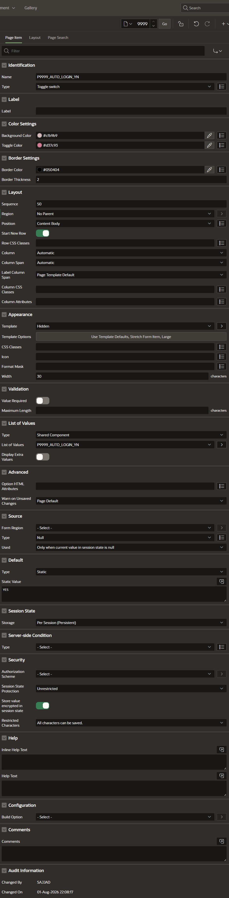

# 📦 Installation

This guide walks through importing the plug-in and configuring your first toggle switch item.

**Estimated time:** about 5 minutes.

---

## ✅ Requirements

| Requirement | Details |
|-------------|---------|
| Oracle APEX | 23.2 or later |
| Theme | Universal Theme |
| Privileges | Ability to import plug-ins into the target application |

The plug-in has no external dependencies — no icon fonts, no JavaScript libraries, no database objects. Everything it needs ships inside the export file.

---

## 1️⃣ Download the plug-in

Download the export file from this repository:

```
plugin/item_type_plugin_sh_toggle_switch.sql
```

On GitHub, open the file and use the **Download raw file** button. Do not copy the file contents into a text editor and save from there — that can alter the line endings and break the import.

---

## 2️⃣ Import into your application

1. Open your application in **App Builder**
2. Navigate to **Shared Components**
3. Under *Other Components*, click **Plug-ins**
4. Click **Import** in the top right
5. Select the downloaded `.sql` file
6. Set **File Type** to *Plug-in*
7. Click **Next**, then **Next** again on the confirmation screen
8. Choose the target application and click **Install Plug-in**

After a successful import, **Toggle switch** appears in your plug-in list.

**Note on CSS and JavaScript:** Both files are embedded in the export and are installed automatically as plug-in files. There is nothing to upload separately and nothing to reference in your page or application attributes.

---

## 3️⃣ Create a page item

1. Open the page where you want the switch
2. Right-click the region in the rendering tree and choose **Create Page Item**
3. Give it a name, for example `P1_AUTO_LOGIN_YN`
4. Under **Identification → Type**, select **Toggle switch**



---

## 4️⃣ Define the List of Values

The switch renders one segment per LOV entry, so this step decides how many options appear.

Under **List of Values → Type**, choose one of the following.

**Static Values**

```
STATIC:One-Time Login;NO,Remember 1 Year;YES
```

**SQL Query**

```sql
SELECT 'One-Time Login'  AS d, 'NO'  AS r FROM dual
UNION ALL
SELECT 'Remember 1 Year' AS d, 'YES' AS r FROM dual
```

**Shared Component**

If you already maintain the values as a shared List of Values, select it here — this is what the screenshot above shows.

The first column is the label shown inside the segment, the second is the value written to session state.

---

## 5️⃣ Configure the appearance

All four appearance attributes are optional. Leave them empty and sensible defaults apply.

### 🎨 Color Settings

| Attribute | Example | Effect |
|-----------|---------|--------|
| Background Color | `#cfb9b9` | The track behind the segments |
| Toggle Color | `#d37c93` | The sliding knob marking the selection |

### 🖌️ Border Settings

| Attribute | Example | Effect |
|-----------|---------|--------|
| Border Color | `#050404` | Outline around the track |
| Border Thickness | `2` | Border width in pixels, `0` removes it |

Both color fields accept any valid CSS color — hex, RGB, RGBA or named colors. APEX shows a color picker next to each field.

See [attributes.md](attributes.md) for the full reference.

---

## 6️⃣ Set the width

Sizing follows the standard APEX item setting — there is no custom width attribute.

Under **Appearance → Template Options**, enable **Stretch Form Item** for a full-width switch, or pick a size under the item's width setting:

| Setting | Width | Height |
|---------|-------|--------|
| Default | 200px | 34px |
| Large | 300px | 42px |
| X-Large | 400px | 50px |
| Stretch | Fills the container | 34px |

---

## 7️⃣ Set a default value

A switch should always show a selection. Under **Default → Type**, choose *Static* and enter one of your return values, for example `YES`.

If no default is set and session state is empty, the plug-in falls back to selecting the first segment and writes that value into session state on load — so the visible selection and the submitted value never disagree.

---

## ✔️ Verify

Run the page. You should see:

- One segment per LOV entry, evenly distributed across the switch
- The knob positioned over the segment matching the current value
- The knob sliding to the clicked segment, with the label turning white
- Tab moving focus between segments, Enter or Space selecting one

Submit the page and check the value in **Session State** — it should hold the return value of the selected segment.

---

## 🛠️ Troubleshooting

**The switch renders but clicking does nothing**

The JavaScript file did not load. Open the browser console (F12) and look for an error mentioning `shToggleSwitch is not defined`. Re-import the plug-in; the export must include the file under *Files*.

**Segments appear but have no styling**

The stylesheet did not load, for the same reason as above. In the Network tab, filter for `toggle_switch.css` and check whether it is fetched.

**Labels are cut off with an ellipsis**

Too many segments for the current width. Increase the item width, enable Stretch, or shorten the labels.

**The switch is narrower than other items in the form**

Enable **Stretch Form Item** under Template Options, as described in step 6.

**Nothing is selected on page load**

Session state holds a value that matches none of the LOV return values — a common cause is a mismatch in case, for example `Yes` in the default versus `YES` in the LOV. Return values are compared exactly.

---

## 🗑️ Uninstalling
---

## 📄 About

**Toggle Switch** — an item plug-in for Oracle APEX.

| | |
|---|---|
| Author | Sajjad Hanifa |
| Vendor | S&H Software Solutions |
| Version | 1.0.0 |
| License | [MIT](../LICENSE) |
| Repository | [oracle-apex-toggle-switch](https://github.com/Sajjad-786/oracle-apex-toggle-switch) |

Found a bug or have a suggestion? Open an [issue](https://github.com/Sajjad-786/oracle-apex-toggle-switch/issues).
1. Change any page items using the plug-in to a different type
2. Go to **Shared Components → Plug-ins**
3. Open **Toggle switch** and click **Delete**

APEX refuses to delete a plug-in that is still referenced by an item, so step 1 comes first.
